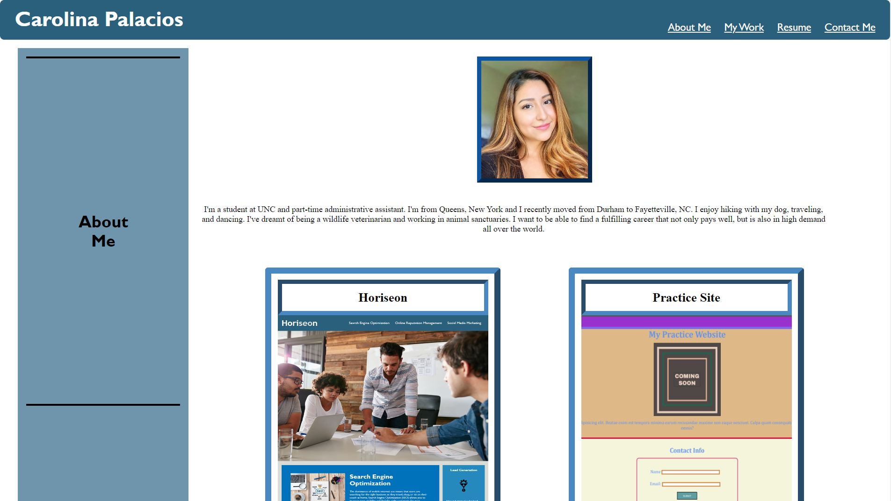
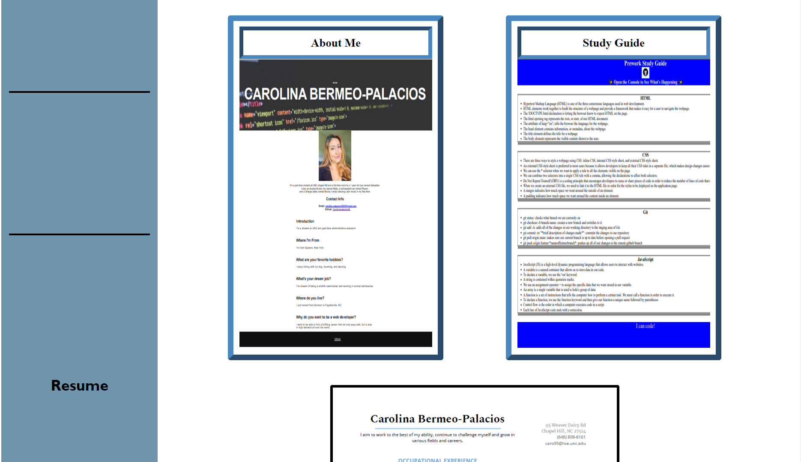
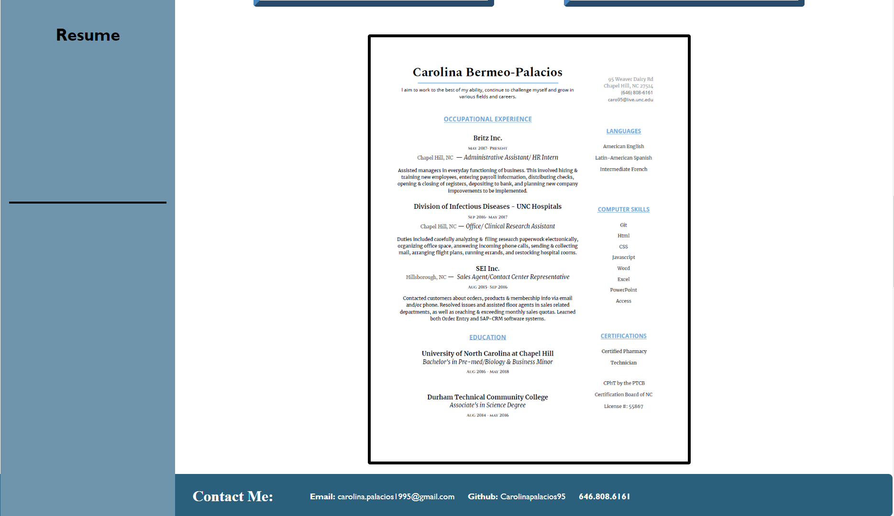

# Portfolio

>## My Task

  Apply the core skills I've recently learned such as flexbox, media queries, and CSS variables in a portfolio in order to showcase talents to employers looking to fill a part-time or full-time position.

>## Code Style & Tech/Framework Used

  For this project, I've utilized Visual Studio Code in order to edit the webpage's html and css attributes and implement these changes.

>## Demo

The following image shows the web application's appearance and functionality:

The webpage can be found at [My Portfolio](https://carolinapalacios95.github.io/portfolio/)

>## Features

*  Applied and showcased the core skills I've recently learned: flexbox, media queries, and CSS variables.

* Followed best practices for class/id naming conventions, indentation, and quality comments.

* Included a preview of my work, skills, and qualifications on a webpage made using the tools we've learned thus far in the coding bootcamp.

## License

---
© 2021 Trilogy Education Services, LLC, a 2U, Inc. brand. Confidential and Proprietary. All Rights Reserved.
